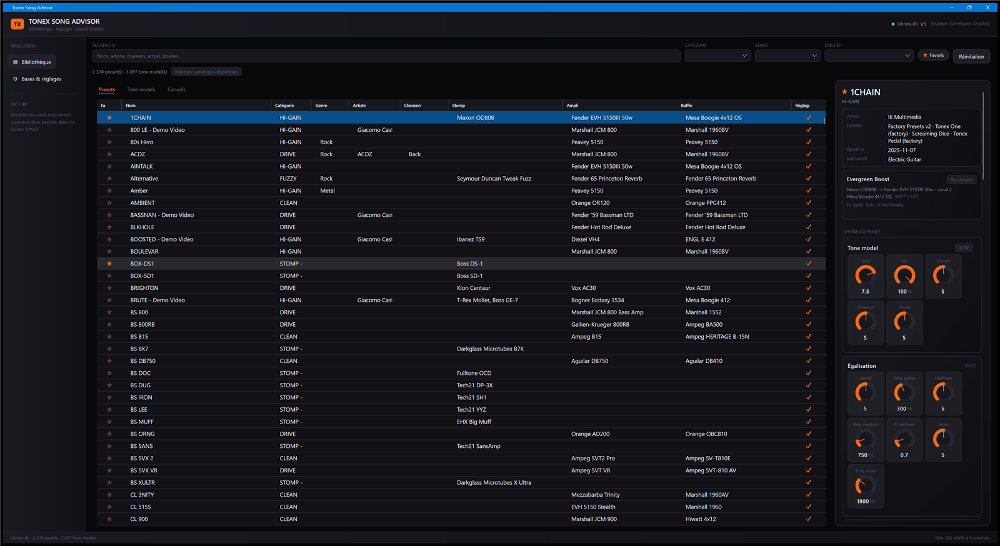
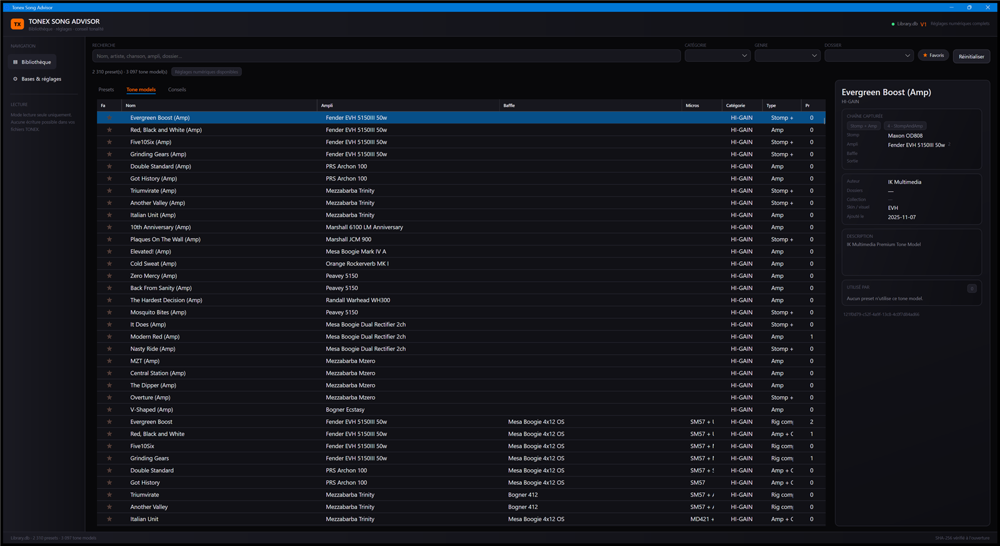
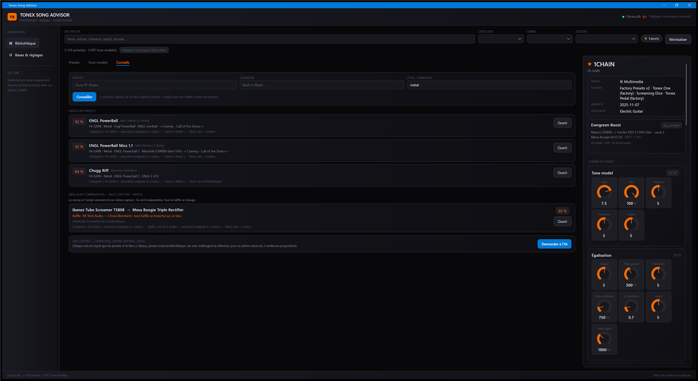
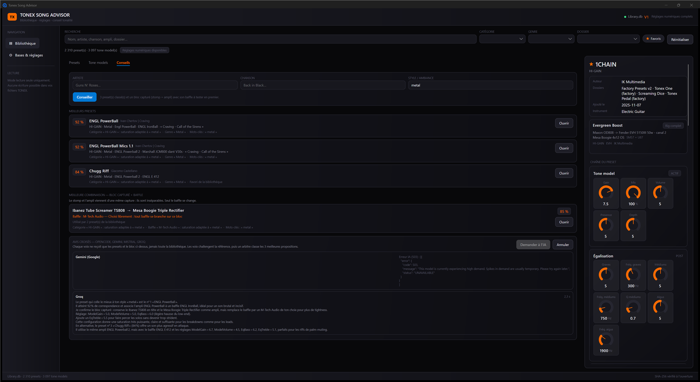
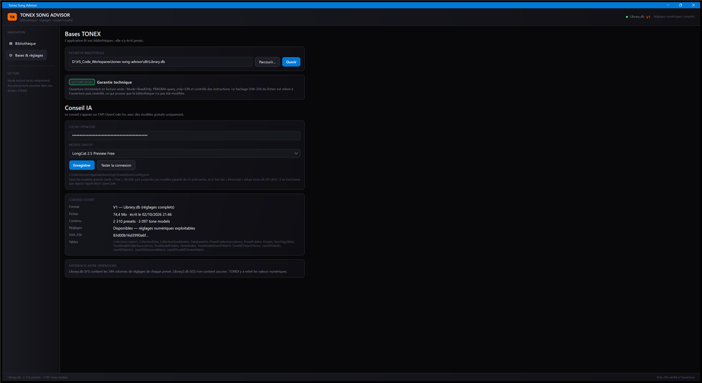

# Tonex Song Advisor

Application de bureau (.NET 9 + Avalonia 12) qui **lit** les bibliothèques IK Multimedia TONEX
(format V1 `Library.db` et V2 `Library2.db`), les affiche en tableau et conseille le meilleur
preset / la meilleure combinaison **ampli + stomp + cab** pour une chanson ou un artiste donné.

> 🔒 **Accès strictement en lecture seule.** Les bases TONEX ne sont jamais modifiées :
> `Mode=ReadOnly` + `Pooling=False` + `PRAGMA query_only=ON` + filtrage des verbes SQL
> (`SELECT`/`WITH`/`EXPLAIN` uniquement), et empreintes SHA-256 capturées à l'ouverture puis
> revérifiées à la fermeture.

## Installation

Deux formats sont publiés à chaque [release](https://github.com/brunothesatellite/tonex-song-advisor/releases) :

| Fichier | Usage |
|---|---|
| `TonexSongAdvisor-x.y-setup.exe` | **Installation** : par utilisateur, sans droits administrateur — raccourcis menu Démarrer et bureau, entrée « Ajout ou suppression de programmes » avec désinstallation. |
| `TonexSongAdvisor-x.y-portable.zip` | **Portable** : décompresser et lancer `TonexAdvisor.App.exe`, rien n'est installé. |

Windows 10/11 x64, aucune installation de .NET nécessaire (application autonome).

> **Exécution non signée** : les exécutables ne sont pas signés — Windows SmartScreen affiche
> « Application non reconnue » : « Plus d'infos » puis « Exécuter quand même ».

L'installateur (`tools/Setup`) est du **code du projet** : aucun utilitaire tiers n'est utilisé
pour le construire. Rappel de la règle de licence du projet — WiX est sous MS-RL (copyleft
réciproque), NSIS et Inno Setup sous des licences hors liste : nous fabriquons donc notre propre
installeur, en MIT comme le reste.

Pour reconstruire les deux artefacts : `powershell -ExecutionPolicy Bypass -File tools\build-release.ps1 -Version x.y`.
## Manuel utilisateur

Les captures viennent d'une bibliothèque d'exemple : les noms de presets changent selon la vôtre.

### 1. L'écran Bibliothèque (onglet Presets)



- **Recherche** : un seul champ couvre tout (nom, artiste, chanson, ampli, dossier, auteur).
  Plusieurs mots = tous doivent être présents.
- **Filtres** : catégorie, genre, dossier, et le bouton **Favoris** qui garde les presets marqués
  étoile dans TONEX.
- **Réinitialiser** efface recherche et filtres.
- Les colonnes se **trient** : un clic sur l'en-tête trie en croissant, un second en décroissant.
- La chaîne capturée se lit de gauche à droite : **Stomp → Ampli → Baffle**. Le stomp et l'ampli
  viennent de la même capture et sont inséparables ; le baffle est le seul élément interchangeable
  — y compris pour un « rig complet », dont le stomp reste affiché même sans ampli nommé.
- Le **panneau de droite** détaille la ligne sélectionnée : métadonnées, tone model lié,
  potentiomètres en lecture seule, sections matériel masquables.
- La colonne **Réglages** indique (coche orange ou tiret) si le preset embarque des réglages
  numériques exploitables : c'est le cas en génération 1, jamais en génération 2.
- Vos filtres et l'onglet actif sont **retrouvés au lancement suivant**
  (`%APPDATA%\TonexAdvisor\state.json`).

### 2. L'onglet Tone models



Les captures (stomp, ampli, baffle, micros) et le nombre de presets qui les utilisent. La
sélection alimente le même panneau de détail.

### 3. L'onglet Conseils : le classement local



1. Décrivez la chanson : **artiste**, **chanson**, **style/ambiance** (« metal », « blues saturé »,
   « clean funk ») — un seul champ suffit.
2. Cliquez **Conseiller** : la bibliothèque est classée en quelques millisecondes, hors ligne, et
   l'écran affiche :
   - les **3 meilleurs presets**, avec score et raisons (« Catégorie HI-GAIN : saturation adaptée
     à « metal » », « Genre « Metal » », « Favori de la bibliothèque »…) ;
   - le **meilleur bloc capturé**, `stomp → ampli` : les deux viennent de la **même capture** et
     sont inséparables ;
   - le **baffle** conseillé, toujours signalé comme **remplaçable par tout autre baffle** — c'est
     la seule pièce interchangeable dans TONEX.
3. **Ouvrir** sélectionne la ligne correspondante dans la grille, filtres réinitialisés.

### 4. Le conseil IA



- **Demander à l'IA** envoie la demande + le catalogue de la bibliothèque : chaque ampli avec
  les stomp capturés avec lui, et la liste des baffles — **noms uniquement**, les plus utilisés
  d'abord (200 amplis + 120 baffles, ≈ 3 400 tokens : la taille que les quotas gratuits
  acceptent). L'IA choisit donc en connaissance de cause, y compris sur les noms que la recherche
  locale ne peut pas deviner, tout en respectant la règle « stomp + ampli inséparables » — le
  baffle restant libre.
- La réponse a **deux parties** : ce que ta bibliothèque permet (`BLOC`, `BAFFLE`, `RÉGLAGES`,
  `ALTERNATIVE`), puis un **CONSEIL LIBRE** — ce que l'IA utiliserait elle, sans contrainte : le
  matériel réel du morceau ou du style, et les réglages typiques qui vont avec. C'est la partie
  utile quand ta bibliothèque n'a rien de vraiment proche.
- La réponse s'écrit **au fil de l'eau** ; la chaîne de pensée s'affiche pendant la génération
  puis disparaît quand la réponse arrive.
- Clé absente, réseau en panne, quota dépassé : message explicite et **le classement local reste
  affiché** — l'IA est un plus, jamais la seule source de conseil.
- **Annuler** interrompt la génération.

### 5. Bases & réglages : la clé API



- La clé OpenCode se saisit ici (masquée à l'écran) et est stockée dans
  `%APPDATA%\TonexAdvisor\config.json`, **hors dépôt**.
- Choix du **modèle gratuit** (LongCat 2.5 Preview Free par défaut, Space Bunny Free) et bouton
  **Tester la connexion**.
- L'écran affiche aussi le format détecté (V1 ou V2) et rappelle la garantie de lecture seule.

### Ce que l'application ne fait jamais

- elle **n'écrit jamais** dans les bases TONEX : empreintes SHA-256 vérifiées avant/après par les
  tests, connexion `Mode=ReadOnly`, `PRAGMA query_only` et filtrage des verbes SQL ;
- elle n'ouvre **jamais** le dossier `Documents\IK Multimedia\TONEX` : seules les copies
  `db\Library.db` et `db\Library2.db` du projet sont lues ;
- elle ne versionne **aucune clé** ni aucune base (voir `.gitignore`).
## Compiler et tester

```powershell
$dotnet = "$env:USERPROFILE\.dotnet\dotnet.exe"
& $dotnet build TonexAdvisor.sln -v minimal
& $dotnet test tests\TonexAdvisor.Core.Tests\TonexAdvisor.Core.Tests.csproj -v minimal
& ".\src\TonexAdvisor.App\bin\Debug\net9.0\TonexAdvisor.App.exe"
```

Prérequis : SDK .NET 9.

### Publier une version autonome

```powershell
& $dotnet publish src\TonexAdvisor.App\TonexAdvisor.App.csproj -c Release -r win-x64 `
    --self-contained -o .\publish
```

Le dossier `publish\` contient l'exécutable (icône comprise) et tout le nécessaire pour tourner
sans .NET installé (~200 Mo). Il est hors dépôt.

## Clé API OpenCode (conseil IA)

La clé API n'est **jamais versionnée** : elle est stockée dans un fichier hors dépôt,

```
%APPDATA%\TonexAdvisor\config.json
```

créé automatiquement au premier **Enregistrer** depuis *Réglages → Conseil IA*. Tu peux aussi le
créer toi-même :

```json
{
  "ApiKey": "oc_sk_…",
  "Model": "longcat-2.5-preview-free",
  "Endpoint": "https://opencode.ai/zen/go/v1"
}
```

Où l'obtenir : <https://opencode.ai/settings/api>. Le `.gitignore` interdit également
`config.json`, `*.config.json`, `*.secrets.json` et `.env*` à l'intérieur du dépôt, par sécurité.

**Seuls les modèles gratuits (« Free », illimités) sont proposés** dans la liste déroulante :

| Modèle | Offre | Disponible avec une clé API ? |
|---|---|---|
| `longcat-2.5-preview-free` (défaut) | OpenCode Go | ✅ oui |
| `space-bunny-free` | OpenCode Go | ✅ oui |
| `mimo-v2.6-flash-free`, `ling-3.1-flash-free`, `nemotron-3.5-lightning-free`, `fledge-alpha-free`, `muse-spark-1.3-contributor-free`… | Personnel (Zen) | ❌ `403 FreeTierError` |

Le free tier **Personnel** n'accepte que les sessions OAuth de l'application OpenCode
(`OpenCode's free tier can only be used from within OpenCode`) : ces modèles sont donc écartés
d'une application tierce qui n'utilise qu'une clé `oc_sk_`. Le bouton **Tester la connexion**
vérifie la clé et le modèle choisi par une vraie requête.

## Clés IA (avis croisés)

Le conseil peut croiser plusieurs avis : **OpenCode** (la référence) et, **si vous renseignez leur
clé**, **Gemini**, **Mistral** et **Groq**. Chaque voix reçoit la même demande et le même
catalogue de blocs et de baffles, puis répond indépendamment — donc souvent en désaccord — puis un arbitre
confronte les avis et classe les **3 meilleures propositions** avec leur niveau de consensus.

| Voix | Où demander une clé API | Modèle gratuit par défaut |
|---|---|---|
| **OpenCode Go** (référence) | <https://opencode.ai/> (offre *Go*) | `longcat-2.5-preview-free` |
| **Gemini** (Google) | <https://aistudio.google.com/apikey> | `gemini-flash-latest` |
| **Mistral** | <https://console.mistral.ai/api-keys> | `mistral-small-latest` |
| **Groq** | <https://console.groq.com/keys> | `openai/gpt-oss-120b` |

- Les clés se saisissent dans **Bases & réglages**, masquées, et sont stockées dans
  `%APPDATA%\TonexAdvisor\config.json` — **jamais dans le dépôt**.
- Vous n'êtes pas obligé de toutes les renseigner : **une clé absente = une voix silencieuse**,
  et le conseil reste valable avec celles que vous avez. Une seule clé = un avis direct, deux ou
  plus = avis contradictoires puis arbitrage.
- Chaque voix a son propre délai (60 s) : un fournisseur lent ou en erreur est simplement signalé
  dans la carte, sans faire échouer les autres.
- Les modèles ci-dessus sont gratuits et remplacés depuis `config.json`
  (`Providers.<id>.Model`) si les tarifs changent. Toutes ces API sont compatibles OpenAI : un
  seul connecteur les pilote.
## Données de test

Les bases TONEX ne sont **pas versionnées** (bibliothèque personnelle, 89 Mo). Pour exécuter les
130 tests, copie tes propres fichiers dans `db/` :

```
db\Library.db     ← format V1 (réglages numériques complets)
db\Library2.db    ← format V2 (métadonnées)
```

## Structure

| Dossier | Rôle |
|---|---|
| `src\TonexAdvisor.Core` | lecture des bases (read-only), DTOs, index, tokeniseur, ranges |
| `src\TonexAdvisor.App` | UI Avalonia, thème `Themes\DarkRock.axaml`, ViewModels |
| `tests\TonexAdvisor.Core.Tests` | 130 tests |
| `TODO.md` | état d'avancement et travail restant |

## Avancement

Voir [TODO.md](TODO.md) — v0.1 : lecture + navigateur + détail des presets, réglages IA
(clé API + modèles gratuits + test de connexion). Voir [TODO.md](TODO.md) - v0.1 : lecture + navigateur + détail des presets, réglages IA
(clé API + modèles gratuits + test de connexion), recommandation locale avec l'onglet
« Conseils » (meilleurs presets + bloc capturé et baffle). Voir [TODO.md](TODO.md) - v0.1 : lecture + navigateur + détail des presets, réglages IA
(clé API + modèles gratuits + test de connexion), recommandation locale avec l'onglet
« Conseils » (meilleurs presets + bloc capturé et baffle) et conseil IA en streaming à partir
de cette sélection. Reste : fiabilité et finitions (Phase 5).
